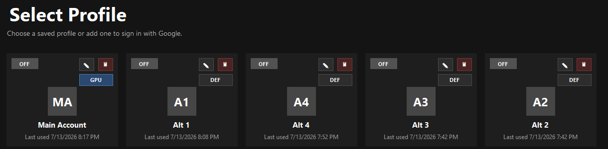
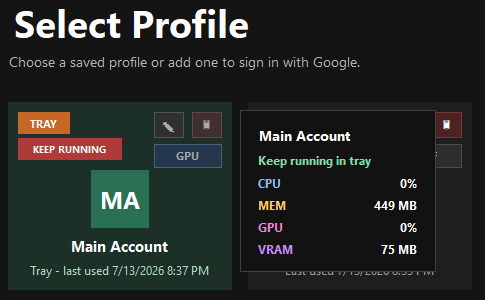
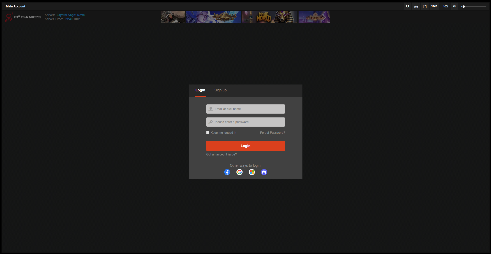
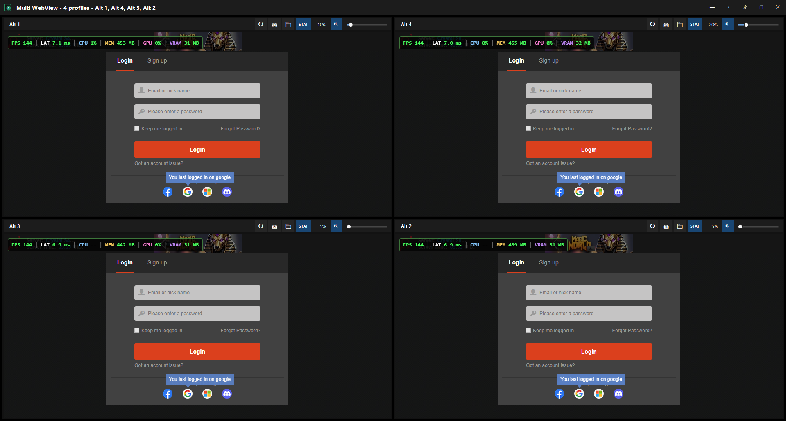
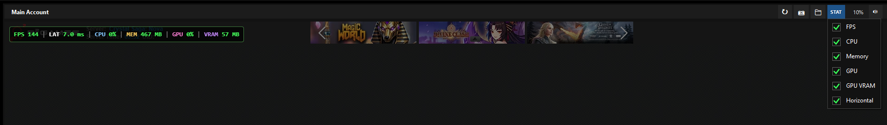
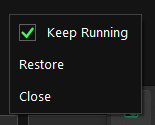

# Features

This document describes the major user-facing Multi WebView features. See `TECHNICAL.md` for implementation details.

## Profile Picker

The profile picker is the main window. It lists saved profiles as cards with state chips:



- `OFF`: profile is closed and can be selected, edited, deleted, or switched between `GPU` and `DEF`.
- `OPEN`: profile is already active in a browser window.
- `TRAY`: profile is active in a browser window that is currently in the tray.
- `KEEP RUNNING`: the owning browser window is in keep-running tray mode.

Open profiles cannot be selected, edited, deleted, or switched between `GPU`, `DEF`, and `LITE` until their browser window is closed. Locked card actions stay visually readable, show a blocked cursor, and ignore clicks.

Hovering an open profile shows a compact dark usage popup with CPU, memory, GPU, and GPU memory values for that profile's WebView2 processes. The popup header shows the profile name and state above a divider, with metrics below.



## Isolated Profiles

Each app profile has its own WebView2 user data folder. Cookies, sign-ins, local storage, screenshots, saved volume, mute state, stats overlay settings, and WebView mode are stored per profile.

By default, profile data is stored under:

```text
%LOCALAPPDATA%\MultiWebView\Profiles
```

The profile storage folder can be changed from the picker. Existing app data is not encrypted by Multi WebView, so real profile folders should not be committed or shared publicly.

## Multi-View Windows

Profiles can be opened individually or together in a tiled multi-view browser window. Each tile hosts one WebView2 instance and includes controls for:

- full WebView recreation through the refresh button
- screenshot capture
- opening the profile folder
- popping that profile out into its own browser window
- `STAT` overlay options
- mute
- volume

Refreshing a tile recreates that tile's WebView and reuses the same profile data, audio state, and stats settings.
Popping a tile out closes that tile in the source window, reflows the remaining profiles, and opens the popped profile in a new one-profile browser window. Profile data is preserved, but the page is loaded again because Multi WebView avoids running two WebView2 controls against the same profile folder at the same time.





## Pop-Out Windows

Use the pop-out button in a tile header when one profile should leave a group without closing the other profiles. The source window stays open with the remaining profiles, unless the popped profile was the last tile. The picker continues to treat the popped profile as open, so its profile card focuses the new browser window instead of opening a duplicate session.

## Drag To Combine

Browser windows can be dragged into another visible browser window. Drag the source window by its title bar over the target window, move over the target tiles to choose the insertion position, and release when the target highlights. A lightweight owned adorner window paints a virtual open block sized to the number of source profiles above the WebView2 surface without moving live WebView2 controls during hover. The source window closes after its profiles are added as contiguous tiles in the target window.

Multi-profile source windows merge as a group, so a two-profile window can be dragged into another two-profile window to create a four-profile window. To move only one profile from a group, pop out that tile first, then drag the one-profile window into the target.

## Per-Profile WebView Mode

Closed profiles can be switched between `GPU`, `DEF`, and `LITE` from the profile card.

`GPU` mode creates WebView2 with the app's high-GPU/browser-throttling arguments, including GPU rasterization, zero-copy, ignored GPU blocklist, reduced background throttling, and autoplay-friendly audio-session setup.

`DEF` mode creates a plain default WebView2 environment without those extra arguments.

`LITE` mode keeps the autoplay-friendly audio-session setup but avoids the high-GPU and anti-throttling arguments. It keeps the WebView loaded and network-capable, but Chromium may still reduce background rendering work when the tile or window is not visible.

The setting is saved per profile as `WebViewMode`. Already-open WebViews keep the environment they were created with until the tile is refreshed or the profile is closed and reopened.

## Active Profile Mode

Each multi-view tile includes an `ACT` header button. Click it to switch that tile to `IDLE`, which hides that tile's WebView behind a click-to-activate placeholder and runtime-mutes it while leaving the profile loaded. Click the placeholder or the `IDLE` button to make that tile active again and restore its normal saved/current mute state. Multiple tiles can remain active at the same time.

Inactive state belongs to the current browser window only. If a profile is popped out or moved to another window, the source window drops that tile's inactive state.

## Live Diagnostics

Each WebView tile has a `STAT` menu for optional overlay values:



- `FPS`
- `LAT`
- `CPU`
- `Memory`
- `GPU`
- `GPU VRAM`
- `Horizontal`

The profile picker also shows a compact usage popup while hovering an open profile card. CPU and memory are sampled from the WebView2 process tree. GPU and GPU VRAM use Windows performance counters and should be treated as approximate diagnostic values.

Stats timers run only while at least one stats option is enabled, and profile-picker usage sampling runs only while hovering an open profile.

## Audio Controls

Volume and mute state are saved per profile. The app applies audio state through WebView2 mute and Windows Core Audio sessions for the WebView2 process tree.

When a WebView initializes, Multi WebView creates an inaudible Web Audio session so Windows Volume Mixer has a session available before a real page starts playing sound.

## Tray Modes

The profile picker can hide to the system tray. Multi-view browser windows have separate tray controls:

- `Default`: hides the window normally to reduce rendering resource use.
- `Keep running`: keeps the native host window alive offscreen to reduce hidden-window throttling for games, animation-heavy pages, and timer-sensitive pages.

While a multi-view window is in the tray, its WebViews are force-muted at runtime. Restoring the window reapplies each profile's normal mute state.



## Screenshots

Each WebView tile can save a PNG screenshot of the visible viewport to that profile's `screenshots` folder:

```text
<AppDataPath>\<profile-id>\screenshots
```

After capture, the app shows a temporary status popup. Clicking that popup opens the screenshot folder.
